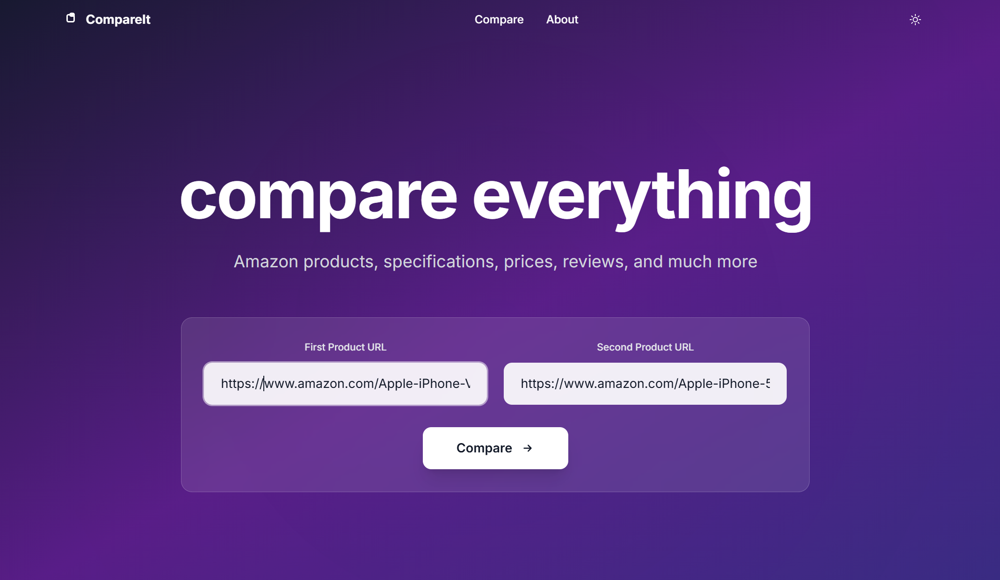

# CompareIt - Amazon Product Comparison Tool

A modern, AI-powered Amazon product comparison tool that helps you make smarter shopping decisions by analyzing products side-by-side.



## 🚀 Features

- **Side-by-Side Comparison**: Compare any two Amazon products instantly
- **Detailed Analysis**: View specifications, prices, ratings, and customer reviews
- **Modern UI/UX**: Clean, responsive design with dark/light mode support
- **Free to Use**: No registration required, completely free
- **AI Features Coming Soon**: Smart recommendations and interactive chat assistant

## 🛠️ Tech Stack

- **Frontend**: React 18, Vite, Tailwind CSS
- **Backend**: Express.js, Node.js
- **Deployment**: Vercel (Serverless Functions)
- **API**: ScrapingDog Amazon Product API
- **Icons**: Heroicons

## 📋 Prerequisites

- Node.js 16+ 
- npm or yarn
- ScrapingDog API key

## 🚀 Quick Start

1. **Clone the repository**
   ```bash
   git clone https://github.com/yourusername/compareit.git
   cd compareit
   ```

2. **Install dependencies**
   ```bash
   npm install
   ```

3. **Set up environment variables**
   ```bash
   # Create .env file in the root directory
   echo "API_KEY=your_scrapingdog_api_key_here" > .env
   ```

4. **Start development server**
   ```bash
   npm run dev
   ```

5. **Open your browser**
   ```
   http://localhost:5173
   ```

## 🌐 Deployment

### Vercel Deployment

1. **Connect your repository to Vercel**
2. **Add environment variable**
   - `API_KEY`: Your ScrapingDog API key
3. **Deploy**

The project includes a `vercel.json` configuration for optimal deployment.

## 🔑 API Configuration

This project uses [ScrapingDog](https://scrapingdog.com/) for Amazon product data extraction.

### Getting API Key

1. Visit [ScrapingDog](https://scrapingdog.com/)
2. Sign up for a free account
3. Get your API key from the dashboard
4. Add it to your `.env` file

## 📝 Usage

1. **Paste Product URLs**: Enter two Amazon product URLs
2. **Click Compare**: Get instant side-by-side comparison
3. **Analyze Results**: Review specifications, prices, and reviews
4. **Make Decision**: Choose the best product for your needs


## 🚧 Current Limitations

- **Amazon.com Only**: Currently supports only Amazon.com (US) products
- **Development Phase**: The project is still under active development
- **Rate Limits**: Subject to ScrapingDog API rate limits

## 🤖 AI Features (Coming Soon)

We're working on AI features:

- **Smart Recommendations**: AI will analyze comparisons and recommend the best product
- **Interactive Chat**: Ask specific questions about product comparisons
- **Pros & Cons Analysis**: Detailed explanations of why to choose or avoid products

## 🤝 Contributing

We welcome contributions! Here's how you can help:

### Ways to Contribute

- 🐛 **Report Bugs**: Found an issue? [Open an issue](https://github.com/yourusername/compareit/issues)
- 💡 **Feature Requests**: Have ideas? We'd love to hear them!
- 🔧 **Code Contributions**: Submit pull requests for bug fixes or new features
- 📚 **Documentation**: Help improve our docs
- 🎨 **Design**: UI/UX improvements and suggestions

### Development Setup

1. Fork the repository
2. Create a feature branch: `git checkout -b feature/amazing-feature`
3. Make your changes
4. Run tests: `npm test` (when available)
5. Commit changes: `git commit -m 'Add amazing feature'`
6. Push to branch: `git push origin feature/amazing-feature`
7. Open a Pull Request

### Code Guidelines

- Follow existing code style
- Write clear commit messages
- Add comments for complex logic
- Test your changes thoroughly

## 📁 Project Structure

```
├── api/                    # Vercel serverless functions
│   └── product.js         # Product data API endpoint
├── src/
│   ├── components/        # React components
│   │   ├── ComparisonTable.jsx
│   │   ├── ReviewsSection.jsx
│   │   └── Navbar.jsx
│   ├── pages/            # Page components
│   │   └── HomePage.jsx
│   ├── App.jsx           # Main app component
│   └── main.jsx          # Entry point
├── public/               # Static assets
├── .env                  # Environment variables
├── package.json          # Dependencies
└── vercel.json          # Vercel configuration
```


## 🐛 Known Issues

- Loading times may vary based on API response
- Some product specifications might not be available
- Image loading depends on Amazon's CDN
- ScrapingDog server seems to be down at certain times a week

## 📄 License

This project is licensed under the MIT License - see the [LICENSE](LICENSE) file for details.

## ⭐ Support

If you found this project helpful, please give it a ⭐ on GitHub!

---

**Disclaimer**: This project is not affiliated with Amazon. Amazon and all related logos are trademarks of Amazon.com, Inc.
